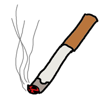
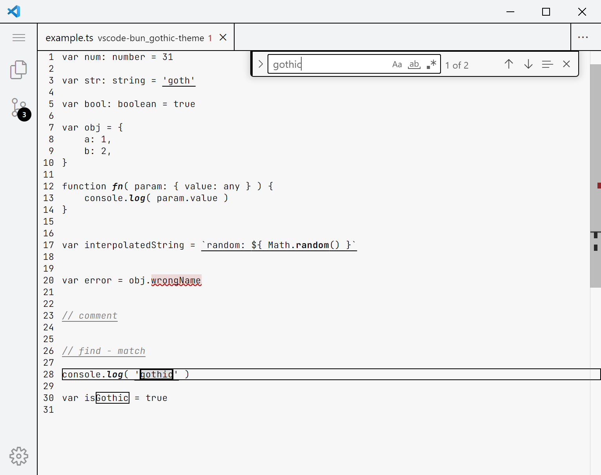

	

# bun_gothic

Первая готическая тема для vscode.

## Концепция
bun_gothic - цветовая тема для готов. Только тьма. Никаких пёстрых цветов.

## Особенности

### Разрыв шаблона

bun_gothic подрывает ваше шаблонное мышление о цветовых темах и заставляет вас почувствовать настоящую боль.

### Цвета

Для гота существуют только три цвета:
- чёрный — ночь
- серый — тлен
- красный — кровь

Все остальные цвета — отстой, оставьте их для эмо.

### Вид темы

bun_gothic, как и все готы, поддерживает только светлую тему. Тёмные темы для позёров.

### Функции

В bun_gothic все определения и вызовы функций выделяются курсивом и жирным шрифтом.

### Строки

В bun_gothic все строки выделяются с помощью подчёркивания.

### Ошибки

Ошибки неизбежны. Они причиняют нам боль, но делают сильнее.

В bun_gothic ошибки, помимо стандартного волнистого подчёркивания, полностью заливаются красным цветом.
Стоит ли говорить, что с таким подходом вы заметите, что ваш код истекает кровью, намного быстрее, нежели используя ~~эмо-темы~~ другие темы, где на вас вываливаются две тысячи красок, обнаружить среди которых красную волнистую линию невозможно?

### Комментарии

Комментарии в bun_gothic выделяются с помощью подчёркивания и курсива. А для большей контрастности с кодом, они имеют серый цвет.

### Системы контроля версий

Настоящие готы используют только `git diff`, пользоваться графическим интерфейсом для просмотра изменений — удел конформистов.

Тем не менее, в bun_gothic есть поддержка цветов для ГИ систем контроля версий:

- чёрный — добавленный фрагмент
- серый — измененный фрагмент
- кроваво-красный — удалённый фрагмент

## Обратная связь

Если заметили, что в теме затесались неготические цвета или какие-то элементы интерфейса выглядят неготично — не стесняйтесь и открывайте ишью.
Давайте вместе победим конформизм.
